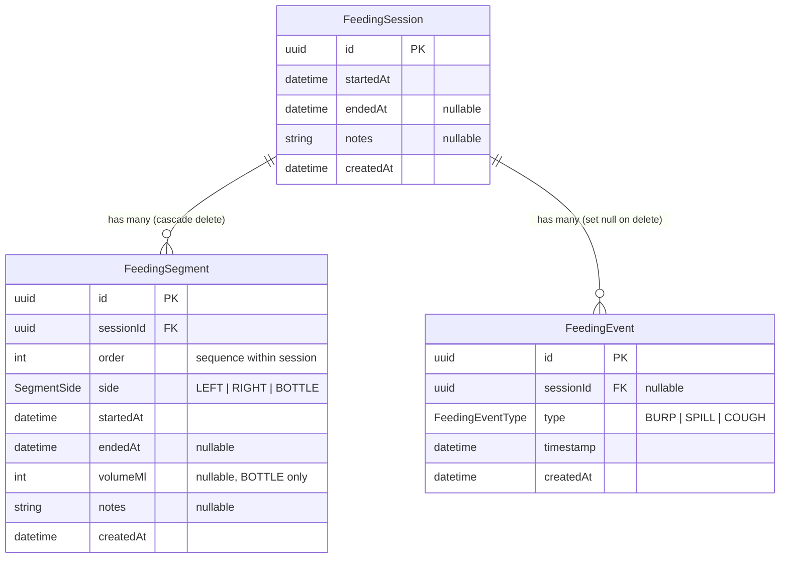

# Baby Luki — Data Model

## ER Diagram

## Models

### FeedingSession

A feeding session represents one full feeding routine (e.g. left breast, burp, right breast, bottle top-up). It groups one or more **FeedingSegments** together. `startedAt` is set by the client device when the session is created. `endedAt` stays null until the parent explicitly ends the session.

### FeedingSegment

A single breast or bottle feed within a session. Each segment has an `order` field that tracks its sequence within the session. The `side` enum can be `LEFT`, `RIGHT`, or `BOTTLE`. `volumeMl` is only relevant for `BOTTLE` segments. Segments cascade-delete when their parent session is deleted.

The `[sessionId, order]` pair is unique — you can't have two segments with the same order in one session.

### FeedingEvent

A point-in-time event during a feed (burp, spill, or cough). Automatically linked to the active session when logged. The session link is set to null if the session is deleted.

## Enums

| Enum | Values | Used by |
|------|--------|---------|
| `SegmentSide` | `LEFT`, `RIGHT`, `BOTTLE` | FeedingSegment.side |
| `FeedingEventType` | `BURP`, `SPILL`, `COUGH` | FeedingEvent.type |

## Indexes

| Table | Index | Purpose |
|-------|-------|---------|
| FeedingSession | `startedAt` | Fast lookup of sessions by date |
| FeedingSegment | `[sessionId, startedAt]` | Fast lookup of segments within a session |
| FeedingEvent | `timestamp` | Fast lookup of events by time |
| FeedingEvent | `sessionId` | Fast lookup of events by session |