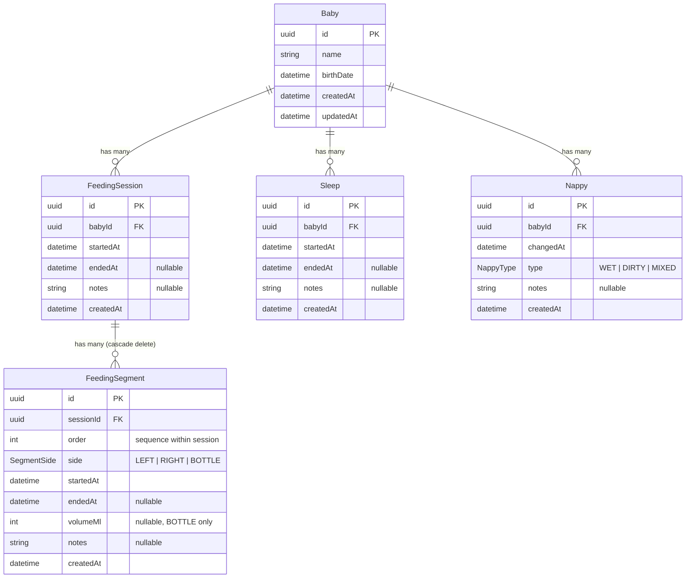

# Baby Luki — Data Model

## ER Diagram

## Models

### Baby

The central entity. In Slice 1 there is no auth or User model — a baby exists on its own. When auth is added later, a `userId` foreign key will link babies to their parent/caregiver.

### FeedingSession

A feeding session represents one full feeding routine (e.g. left breast, burp, nappy change, right breast, bottle top-up). It groups one or more **FeedingSegments** together. `startedAt` is server-stamped when the session is created. `endedAt` stays null until the parent explicitly ends the session.

### FeedingSegment

A single breast or bottle feed within a session. Each segment has an `order` field (auto-incremented by the backend) that tracks its sequence within the session. The `side` enum can be `LEFT`, `RIGHT`, or `BOTTLE`. `volumeMl` is only relevant for `BOTTLE` segments. Segments cascade-delete when their parent session is deleted.

The `[sessionId, order]` pair is unique — you can't have two segments with the same order in one session.

### Sleep

A sleep period. Same start/end pattern as feeding sessions — `endedAt` is null while the baby is still sleeping.

### Nappy

A nappy change event. Uses `changedAt` instead of start/end since it's a point-in-time event. The `type` enum can be `WET`, `DIRTY`, or `MIXED`.

## Enums

| Enum | Values | Used by |
|------|--------|---------|
| `SegmentSide` | `LEFT`, `RIGHT`, `BOTTLE` | FeedingSegment.side |
| `NappyType` | `WET`, `DIRTY`, `MIXED` | Nappy.type |

## Indexes

| Table | Index | Purpose |
|-------|-------|---------|
| FeedingSession | `[babyId, startedAt]` | Fast lookup of sessions by baby and date |
| FeedingSegment | `[sessionId, startedAt]` | Fast lookup of segments within a session |
| Sleep | `[babyId, startedAt]` | Fast lookup of sleep records by baby and date |
| Nappy | `[babyId, changedAt]` | Fast lookup of nappy changes by baby and date |
